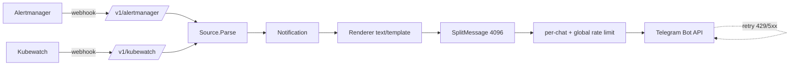

# alertly

[](https://github.com/MaksimRudakov/alertly/actions/workflows/ci.yaml)
[](https://github.com/MaksimRudakov/alertly/releases)
[](https://opensource.org/licenses/MIT)
[](go.mod)
[](https://securityscorecards.dev/viewer/?uri=github.com/MaksimRudakov/alertly)

Lightweight HTTP service that ingests webhooks from **Alertmanager** and **Kubewatch** and forwards them to **Telegram** chats. Stdlib-first, single static binary, distroless image.

## Features

- Sources: Alertmanager (v4 webhook) and Kubewatch (new + legacy payload).
- Multiple chats and topic threads per webhook URL: `/v1/alertmanager/-100123,-100456:42`.
- Per-chat + global Telegram rate limiter; retry with exponential backoff and `Retry-After` honoring.
- Message splitting >4096 chars on rune boundaries, HTML-tag aware.
- `text/template` rendering with helpers (`severity_emoji`, `escape_html`, `truncate`, `join`, `humanize_duration`).
- Bearer-token webhook auth.
- Prometheus metrics, structured `slog` JSON logs, `/healthz` + `/readyz` (Telegram getMe + send-failure window).
- Multi-arch image (amd64, arm64), distroless static, ~10 MB, runs as UID 65532.

## Quick start (Docker)

```bash
docker run --rm -p 8080:8080 \
  -e TELEGRAM_BOT_TOKEN=$TELEGRAM_BOT_TOKEN \
  -e WEBHOOK_AUTH_TOKEN=$WEBHOOK_AUTH_TOKEN \
  -e ALERTLY_CONFIG=/etc/alertly/config.yaml \
  -v $PWD/examples/config.yaml:/etc/alertly/config.yaml:ro \
  ghcr.io/maksimrudakov/alertly:latest
```

## Quick start (Helm)

```bash
helm repo add alertly https://maksimrudakov.github.io/alertly/
helm repo update
helm install alertly alertly/alertly \
  --namespace monitoring-system --create-namespace \
  --set secret.values.telegramBotToken=<TOKEN> \
  --set secret.values.webhookAuthToken=<TOKEN>
```

OCI install (helm ≥ 3.8):

```bash
helm install alertly oci://ghcr.io/maksimrudakov/charts/alertly \
  --version 0.0.1 \
  --namespace monitoring-system --create-namespace \
  --set secret.values.telegramBotToken=<TOKEN> \
  --set secret.values.webhookAuthToken=<TOKEN>
```

For production use an existing Secret (managed by external-secrets/sealed-secrets/vault):

```bash
helm install alertly alertly/alertly \
  --set secret.create=false \
  --set secret.existingSecret=alertly-tokens
```

Chart reference: [`charts/alertly/README.md`](./charts/alertly/README.md).

Both the chart tarball (GitHub Release) and the OCI chart are cosign-signed (keyless, Fulcio/Rekor).

## Endpoints

| Method | Path | Auth | Purpose |
|---|---|---|---|
| `POST` | `/v1/alertmanager/{chats}` | Bearer | Alertmanager webhook |
| `POST` | `/v1/kubewatch/{chats}` | Bearer | Kubewatch webhook |
| `GET`  | `/healthz` | — | Liveness |
| `GET`  | `/readyz`  | — | Readiness (`getMe` ok + recent send health) |
| `GET`  | `/metrics` | — | Prometheus metrics |

`{chats}` accepts a comma-separated list of chat IDs with an optional thread:
`-1001234567890,-100456:42`. Auth: `Authorization: Bearer ${WEBHOOK_AUTH_TOKEN}`.

## Configuration

Path from `ALERTLY_CONFIG` (default `/etc/alertly/config.yaml`). See [examples/config.yaml](./examples/config.yaml).

| Env | Required | Purpose |
|---|---|---|
| `TELEGRAM_BOT_TOKEN` | yes | Bot token used to call the Bot API |
| `WEBHOOK_AUTH_TOKEN` | yes | Bearer token clients must present |
| `ALERTLY_CONFIG` | no  | Path to config (default `/etc/alertly/config.yaml`) |
| `LOG_LEVEL` | no  | Override `logging.level` from config |
| `DRY_RUN`   | no  | When `true`, skip Telegram calls but log/meter |

Hot reload of config is intentionally **not** supported in-process — use [`stakater/Reloader`](https://github.com/stakater/Reloader) to roll the Deployment on ConfigMap/Secret change.

## Templates

Stored inline in YAML, parsed via `text/template`. Helper funcs: `severity_emoji`, `escape_html`, `truncate`, `join`, `humanize_duration`. A template named per source (`alertmanager`, `kubewatch`) is preferred; falls back to `default`.

## Comparison

| | alertly | viento-group/kubernetes-monitoring-telegram-bot | Botkube | Alertmanager `telegram_configs` |
|---|---|---|---|---|
| Language / runtime | Go static, ~10 MB | Kotlin/JVM, ~109 MB | Go, ~150 MB | bundled |
| Maintained | yes | dead since 2021 | yes | yes |
| Alertmanager source | yes | yes | yes (alerts via webhook) | native |
| Kubewatch source | yes | yes | n/a | n/a |
| Multiple chats per webhook URL | yes | yes | n/a | per-receiver |
| Topic threads | yes | no | n/a | yes |
| Message splitting >4096 | yes | no (truncates) | n/a | no (errors) |
| Inline buttons (Phase 2) | planned | no | yes | no |
| Per-chat rate limit | yes | no | n/a | no |
| Prometheus metrics | yes | no | yes | yes |

## Metrics

| Metric | Type | Labels |
|---|---|---|
| `alertly_notifications_received_total` | counter | `source`, `status_code` |
| `alertly_notifications_sent_total` | counter | `chat_id`, `status` |
| `alertly_telegram_api_duration_seconds` | histogram | — |
| `alertly_telegram_retries_total` | counter | `reason` |
| `alertly_telegram_rate_limited_total` | counter | `chat_id` |
| `alertly_template_render_errors_total` | counter | `template` |
| `alertly_message_split_total` | counter | — |
| `alertly_auth_failures_total` | counter | — |
| `alertly_source_parse_duration_seconds` | histogram | `source` |
| `alertly_build_info` | gauge | `version`, `commit`, `go_version` |

## Troubleshooting

| Symptom | Likely cause | Action |
|---|---|---|
| `401 Unauthorized` on every webhook | wrong/missing `Authorization: Bearer` header | check `WEBHOOK_AUTH_TOKEN` matches client config |
| `/readyz` stuck on 503 with `telegram getMe failed` | bot token invalid or egress blocked | verify token via `getMe` manually; check NetworkPolicy / firewall to `api.telegram.org:443` |
| Sends fail with `429 Too Many Requests` | upstream burst > rate limit | already retried with `Retry-After`; tune `telegram.rate_limit.global_per_sec` |
| Template render error in logs | bad `text/template` syntax in config | validate locally; `default` template must always exist |
| Long messages dropped silently | not split? always check `alertly_message_split_total` | verify `parse_mode` is `HTML` and template doesn't emit unbalanced tags |

## Architecture



## Make targets

```
make build       # statically-linked binary in bin/
make test        # go test -race ./...
make test-cover  # coverage report
make lint        # golangci-lint or fallback
make docker      # multi-stage image -> alertly:dev
make run         # run with examples/config.yaml
```

## Contributing

See [CONTRIBUTING.md](./CONTRIBUTING.md). Bugs and ideas → [Issues](https://github.com/MaksimRudakov/alertly/issues), questions → [Discussions](https://github.com/MaksimRudakov/alertly/discussions).

## License

MIT — see [LICENSE](./LICENSE).
