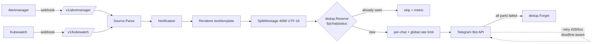

# alertly

[](https://github.com/MaksimRudakov/alertly/actions/workflows/ci.yaml)
[](https://github.com/MaksimRudakov/alertly/releases)
[](https://opensource.org/licenses/MIT)
[](go.mod)
[](https://securityscorecards.dev/viewer/?uri=github.com/MaksimRudakov/alertly)

Lightweight HTTP service that ingests webhooks from **Alertmanager** and **Kubewatch** and forwards them to **Telegram** chats. Stdlib-first, single static binary, distroless image.

## Features

- Sources: Alertmanager (v4 webhook), Kubewatch (new + legacy payload), and a **generic JSON contract** for anything else (GitLab CI, Jira automation, ArgoCD notifications, scripts).
- **Telegram and Slack** side by side: every notification can go to Telegram chats/topics, Slack channels/threads or both, with a **builtin layout** that reads the same in both messengers ([Slack](#slack)).
- **Clusters and named destinations**: one alertly can serve several clusters, each with its own webhook token, Alertmanager and `destination → [telegram…, slack…]` routing; or run one alertly per cluster with the same config model ([Clusters](#clusters-and-destinations)).
- **Interactive Silence buttons** on firing Alertmanager alerts, in Telegram (long polling) and Slack (Socket Mode): silences created through the Alertmanager API v2 (matcher scope configurable), **↩️ Undo** window after each silence, chat/user allowlists, TTL-limited buttons. Off by default (`updates.enabled`).
- **Chat-ops status**: `/status` in Telegram, `/alertly status` in Slack — self-health, per-messenger readiness and the Alertmanager/Watchdog pipeline of every cluster routed to the chat. Off by default (`updates.commands.enabled`).
- Multiple chats and topic threads per webhook URL: `/v1/alertmanager/-100123,-100456:42`.
- Per-chat + global Telegram rate limiter; retry with exponential backoff and `Retry-After` honoring.
- **Deadline-aware retry**: aborts the next backoff sleep when there's no time left to ACK the caller, preventing «delivered to Telegram but caller already gave up» duplicates.
- **In-process deduplication** by `(cluster, fingerprint, target, status)` with TTL — suppresses duplicate messages caused by Alertmanager re-sending a webhook it didn't get an ACK for.
- Message splitting >4096 UTF-16 units (Telegram's own unit — an emoji counts as two) on paragraph/line/word boundaries; HTML formatting survives the cut: tags open at the boundary are closed and reopened on the next part.
- `text/template` rendering with helpers (`severity_emoji`, `escape_html`, `truncate`, `join`, `humanize_duration`).
- Bearer-token webhook auth; optional `telegram.chat_allowlist` restricting which chats webhook URLs may target.
- Prometheus metrics, structured `slog` JSON logs, `/healthz` + `/readyz` (Telegram getMe + send-failure window).
- Multi-arch image (amd64, arm64), distroless static, ~10 MB, runs as UID 65532.

## Quick start (Docker)

```bash
docker run --rm -p 8080:8080 \
  -e TELEGRAM_BOT_TOKEN=$TELEGRAM_BOT_TOKEN \
  -e WEBHOOK_AUTH_TOKEN=$WEBHOOK_AUTH_TOKEN \
  -e ALERTLY_CONFIG=/etc/alertly/config.yaml \
  -v $PWD/examples/config.yaml:/etc/alertly/config.yaml:ro \
  ghcr.io/maksimrudakov/alertly:latest
```

## Installation (Helm)

### Prerequisites

- Kubernetes 1.25+.
- Helm 3.8+ (required for OCI install; any 3.x works for the HTTP repo).
- A Telegram bot token from [@BotFather](https://t.me/BotFather) and any random string for `WEBHOOK_AUTH_TOKEN` (at least 32 chars recommended).
- The bot added to the target chat(s); get the chat ID from [@RawDataBot](https://t.me/RawDataBot) or your own method.

### Add the chart repository

HTTP (GitHub Pages):

```bash
helm repo add alertly https://maksimrudakov.github.io/alertly
helm repo update
helm search repo alertly
```

OCI (GitHub Container Registry, no `helm repo add` needed):

```bash
helm show chart oci://ghcr.io/maksimrudakov/charts/alertly --version 0.7.4
```

### Install

Quick install with tokens passed directly (fine for a lab / personal cluster — **NOT for production**, tokens end up in Helm history):

```bash
helm install alertly alertly/alertly \
  --namespace monitoring-system --create-namespace \
  --version 0.7.4 \
  --set secret.values.telegramBotToken=<TOKEN> \
  --set secret.values.webhookAuthToken=<TOKEN>
```

Or from OCI:

```bash
helm install alertly oci://ghcr.io/maksimrudakov/charts/alertly \
  --namespace monitoring-system --create-namespace \
  --version 0.7.4 \
  --set secret.values.telegramBotToken=<TOKEN> \
  --set secret.values.webhookAuthToken=<TOKEN>
```

### Production install (external Secret)

Create a Secret out of band (external-secrets / sealed-secrets / vault / whatever you use) with the two expected keys:

```yaml
apiVersion: v1
kind: Secret
metadata:
  name: alertly-tokens
  namespace: monitoring-system
type: Opaque
stringData:
  TELEGRAM_BOT_TOKEN: "<TOKEN>"
  WEBHOOK_AUTH_TOKEN: "<TOKEN>"
```

Then install referencing it:

```bash
helm install alertly alertly/alertly \
  --namespace monitoring-system --create-namespace \
  --version 0.7.4 \
  --set secret.create=false \
  --set secret.existingSecret=alertly-tokens \
  --set reloader.enabled=true   # optional: auto-restart on Secret/ConfigMap changes
```

For a fully declarative setup pass a values file instead of `--set` flags — see [`charts/alertly/values.yaml`](./charts/alertly/values.yaml) for the full schema.

### Verify signatures

Both the chart tarball (attached to the GitHub Release) and the OCI chart manifest are **cosign-signed, keyless (Fulcio/Rekor)**. Verify either before installing in a high-trust environment:

```bash
# OCI manifest
cosign verify \
  --certificate-identity-regexp "https://github.com/MaksimRudakov/alertly/.github/workflows/release.yaml@.*" \
  --certificate-oidc-issuer https://token.actions.githubusercontent.com \
  ghcr.io/maksimrudakov/charts/alertly:0.7.4

# .tgz from GitHub Release (download the .tgz and .tgz.bundle from the alertly-0.7.4 release)
# Note: bundles of several earlier 0.7.x releases were made for a different tarball and do not verify (see CHANGELOG); use the OCI check above for those.
cosign verify-blob \
  --bundle alertly-0.7.4.tgz.bundle \
  --new-bundle-format \
  --certificate-identity-regexp "https://github.com/MaksimRudakov/alertly/.github/workflows/release.yaml@.*" \
  --certificate-oidc-issuer https://token.actions.githubusercontent.com \
  alertly-0.7.4.tgz
```

The container image `ghcr.io/maksimrudakov/alertly` is signed the same way.

### Upgrade

```bash
helm repo update
helm upgrade alertly alertly/alertly --namespace monitoring-system --version <new-version> --reuse-values
```

### Uninstall

```bash
helm uninstall alertly --namespace monitoring-system
```

The externally-managed Secret is not deleted (it was not created by the release).

### Values reference

Full list of values with defaults and descriptions: [`charts/alertly/README.md`](./charts/alertly/README.md) (auto-generated from `values.yaml`).

## Endpoints

| Method | Path | Auth | Purpose |
|---|---|---|---|
| `POST` | `/v1/alertmanager/{chats}` | Bearer | Alertmanager webhook |
| `POST` | `/v1/kubewatch/{chats}` | Bearer | Kubewatch webhook |
| `POST` | `/v1/generic/{chats}` | Bearer | Generic JSON events ([contract](#generic-webhook-source)) |
| `POST` | `/v1/clusters/{cluster}/{source}/{destination}` | Bearer (per cluster) | Any source for a named cluster and destination ([Clusters](#clusters-and-destinations)) |
| `GET`  | `/healthz` | — | Liveness |
| `GET`  | `/readyz`  | — | Readiness (periodic `getMe` probe + recent send health) |
| `GET`  | `/metrics` | — | Prometheus metrics |

`{chats}` accepts a comma-separated list of targets: a bare chat ID with an optional thread is Telegram (`-1001234567890,-100456:42`); `tg:` and `slack:` prefixes name the sink explicitly (`tg:-100456:42,slack:C0123ABCDEF`, a Slack thread as `slack:C0123ABCDEF:1712345678.000100`). Auth: `Authorization: Bearer ${WEBHOOK_AUTH_TOKEN}`.

Every webhook answers `200` (all delivered), `204` (nothing to send), `207` (partial — e.g. one messenger down) or `500` (all failed), with a per-sink breakdown: `{"attempts":2,"errors":1,"sinks":{"slack":{"attempts":1,"errors":1},"telegram":{"attempts":1,"errors":0}}}`.

## Configuration

Path from `ALERTLY_CONFIG` (default `/etc/alertly/config.yaml`). See [examples/config.yaml](./examples/config.yaml).

| Env | Required | Purpose |
|---|---|---|
| `TELEGRAM_BOT_TOKEN` | while `telegram.enabled` (default) | Bot token used to call the Bot API |
| `SLACK_BOT_TOKEN` | while `slack.enabled` | Slack bot token (`xoxb-`, scopes `chat:write`, `commands`) |
| `SLACK_APP_TOKEN` | while `updates.slack.enabled` | Slack app-level token (`xapp-`, scope `connections:write`) for Socket Mode |
| `WEBHOOK_AUTH_TOKEN` | unless `clusters` is set | Bearer token for the legacy `/v1/{source}/{chats}` routes |
| *per cluster* `auth_token_env` | for each named cluster | Bearer token for `/v1/clusters/<cluster>/…`; must differ between clusters |
| *per cluster* `<auth_env_prefix>_TOKEN` / `_USERNAME` + `_PASSWORD` | no | Alertmanager API auth of that cluster |
| `ALERTLY_CONFIG` | no  | Path to config (default `/etc/alertly/config.yaml`) |
| `LOG_LEVEL` | no  | Override `logging.level` from config |
| `DRY_RUN`   | no  | When `true`, skip Telegram calls but log/meter |
| `ALERTMANAGER_AUTH_USERNAME` / `ALERTMANAGER_AUTH_PASSWORD` | no | Basic auth for the Alertmanager API (silence buttons) |
| `ALERTMANAGER_AUTH_TOKEN` | no | Bearer auth for the Alertmanager API (takes precedence over basic) |

Hot reload of config is intentionally **not** supported in-process — use [`stakater/Reloader`](https://github.com/stakater/Reloader) to roll the Deployment on ConfigMap/Secret change.

## Templates

Stored inline in YAML, parsed via `text/template`. Helper funcs: `severity_emoji`, `escape_html`, `escape_slack`, `truncate`, `join`, `humanize_duration`. A template named per source (`alertmanager`, `kubewatch`) is preferred; falls back to `default`. The data model also carries `.Cluster` (empty in single-cluster mode).

Rendering is chosen per sink by `format`: `template` (default for Telegram, keeps your `templates.*`) or `builtin` — alertly's own layout, structurally identical in Telegram and Slack (title, `Firing · cluster · severity`, body, the `format.labels` keys, links). Slack templates live under `templates["slack.<source>"]` with fallback `templates["slack.default"]` and produce mrkdwn (escape with `escape_slack`).

> **Escaping**: templates are `text/template`, not `html/template` — there is no auto-escaping. With `parse_mode: HTML`, always pipe user-controlled fields (`.Title`, `.Body`, `.Labels`, `.Annotations`) through `escape_html`, otherwise a label containing `<` or `&` makes Telegram reject the whole message with 400.

## Interactive silence buttons

Firing Alertmanager alerts can carry a row of `🔇 Silence 1h/4h/24h` inline buttons. Pressing one creates a silence via `POST /api/v2/silences`; the keyboard is then replaced with a short-lived **↩️ Undo** button that deletes the silence again. Delivery of button presses uses Telegram **long polling** (`getUpdates`) — no inbound endpoint or Ingress changes.

```yaml
updates:
  enabled: true
  chat_allowlist: [-1001234567890]   # required: only these chats can silence
  user_allowlist: []                 # optional: restrict to specific user IDs
  silence_durations: ["1h", "4h", "24h"]
  button_ttl: 8h                     # buttons expire and are stripped after this
  silence_matchers: []               # [] = all labels (exact instance); e.g. [alertname, namespace] for broader scope
  undo_window: 5m                    # ↩️ Undo lifetime after a silence; 0 disables
alertmanager:
  url: http://alertmanager.monitoring.svc:9093
```

Matcher scope: with empty `silence_matchers` the silence is built from **all** alert labels — it matches only that exact alert instance. Listing labels (e.g. `[alertname, namespace]`) produces a broader silence that also covers sibling alerts sharing those labels; if an alert has none of the listed labels, the press is refused (a zero-matcher silence would match everything).

Operational notes:

- Buttons expire after `button_ttl`; a background sweeper strips expired keyboards, late clicks are rejected. The Undo button has its own shorter sweeper.
- Button and undo state is in-memory: after a pod restart old buttons are rejected with «window expired» (strict policy — no accidental silences/deletes from stale state).
- Callback processing is bounded (15s per press) and transient Alertmanager errors are retried; delivery of callbacks is at-least-once, so in a narrow crash window a silence can be created twice — duplicates are harmless (identical matchers).
- Labels are resolved via the AM API (narrowed server-side by the cached `alertname`) with an in-process fallback cache, so resolving works even when AM has already dropped the alert, is briefly unreachable, or holds too many alerts to list.
- A press is accepted only if its fingerprint (or, for Undo, silence ID) matches what alertly attached to that very message.
- **One poller per bot token.** Telegram allows a single `getUpdates` consumer; a second replica or another process polling the same token gets `409 Conflict` and button presses are split between them. A few conflicts during a rolling update (old and new pod overlap for seconds) are expected and logged as warnings; a streak lasting over 2 minutes is logged as an error `another instance is polling this bot token`. Every conflict counts in `alertly_updates_poll_errors_total{reason="conflict"}` — alert on a sustained rate (e.g. `increase(...[10m]) > 10`), not on a single increment. The Helm chart refuses to render `replicaCount > 1` with `config.updates.enabled`.

## Chat-ops commands

With `updates.commands.enabled: true` (requires `updates.enabled`) the same long-poll loop also answers read-only commands in allowlisted chats:

```yaml
updates:
  enabled: true
  chat_allowlist: [-1001234567890]
  commands:
    enabled: true
```

- `/status` — alertly self-health **and delivery-pipeline diagnostics**: version, uptime, readiness (with reason when unready), time of the last Telegram check, cache sizes — plus, with `commands.status.pipeline: true` (default), an Alertmanager/Prometheus section that answers the on-call question *«the chat went quiet — is that AM down, Prometheus down, or genuinely no alerts?»*:
  - **Alertmanager**: `GET /api/v2/status` — version and cluster state, or an explicit «unreachable» line when AM is down;
  - **Watchdog deadman check**: the always-firing `Watchdog` alert (kube-prometheus-stack) must be present and fresh in AM — missing or stale (>15m) means the Prometheus → AM half of the pipeline died even though AM itself is up; the alert name is configurable via `commands.status.watchdog_alert` (empty disables);
  - **Alerts in AM**: firing/silenced counts — «AM holds N firing but the last webhook is old» points at broken routing, «0 firing» means it is genuinely quiet;
  - **Last webhook / last delivery**: in-memory timestamps of the last parsed webhook (with source) and the last successful Telegram send.

  AM queries are bounded by `commands.status.pipeline_timeout` (default 4s) per call, so a dead AM only delays the reply, never blocks the poller.

Access control is the same as for silence buttons: `chat_allowlist` (required) + optional `user_allowlist`. Unknown commands and non-allowlisted chats are ignored silently — the bot does not reply to unrelated group chatter or commands addressed to other bots. Register the command in [@BotFather](https://t.me/BotFather) via `/setcommands` (`status - alertly self-health`) to get autocompletion in the chat.

## Generic webhook source

`POST /v1/generic/{chats}` accepts alertly's own JSON contract — a single event object or an array (max 100). Any tool that can POST JSON gets the full pipeline: dedup, message splitting, threads, rate limiting.

```json
{
  "title":       "Deploy failed",                  // required
  "body":        "pipeline #123 on main",          // optional
  "severity":    "critical",                       // optional, default "info" (drives severity_emoji)
  "status":      "firing",                         // optional, default "event"; part of the dedup key
  "fingerprint": "deploy-shop-123",                // optional; content hash when absent
  "labels":      {"project": "shop"},              // optional
  "annotations": {},                               // optional
  "links":       [{"title": "Pipeline", "url": "https://gitlab/..."}],
  "timestamp":   "2026-07-05T12:00:00Z"            // optional, RFC3339
}
```

Dedup: identical payloads (same computed or provided fingerprint + status) within `dedup.ttl` are suppressed — send an explicit `fingerprint` when several distinct events may render identical text.

Sender examples:

```bash
# GitLab CI (after_script on failure)
curl -sf -X POST "$ALERTLY_URL/v1/generic/-1001234567890" \
  -H "Authorization: Bearer $WEBHOOK_AUTH_TOKEN" -H "Content-Type: application/json" \
  -d "{\"title\":\"Pipeline failed: $CI_PROJECT_PATH\",\"severity\":\"critical\",\"fingerprint\":\"ci-$CI_PIPELINE_ID\",\"links\":[{\"title\":\"Pipeline\",\"url\":\"$CI_PIPELINE_URL\"}]}"
```

```yaml
# ArgoCD notifications: webhook service + template
apiVersion: v1
kind: ConfigMap
metadata:
  name: argocd-notifications-cm
data:
  service.webhook.alertly: |
    url: http://alertly.monitoring-system.svc:8080/v1/generic/-1001234567890
    headers:
      - name: Authorization
        value: Bearer $webhook-auth-token
  template.app-degraded: |
    webhook:
      alertly:
        method: POST
        body: |
          {
            "title": "ArgoCD: {{.app.metadata.name}} is {{.app.status.health.status}}",
            "severity": "warning",
            "status": "firing",
            "fingerprint": "argocd-{{.app.metadata.name}}-degraded",
            "links": [{"title": "Open in ArgoCD", "url": "{{.context.argocdUrl}}/applications/{{.app.metadata.name}}"}]
          }
```

Jira Automation: add a «Send web request» action with the same JSON body and the `Authorization: Bearer …` header.

## Slack

```yaml
slack:
  enabled: true                  # SLACK_BOT_TOKEN=xoxb-…
  channel_allowlist: [C0123ABCDEF]
format:
  slack: builtin                 # or template: templates["slack.default"]
```

1. Create the app from [`examples/slack-app-manifest.yaml`](./examples/slack-app-manifest.yaml), install it, put the Bot User OAuth Token into `SLACK_BOT_TOKEN`.
2. Invite the bot to each channel (`/invite @alertly`); otherwise sends fail with `not_in_channel`.
3. Address channels by **ID** (`C…`, from the channel details), never by name — names change, IDs do not. Config validation rejects names.

Delivery uses `chat.postMessage` with the same guarantees as Telegram: global + per-channel rate limit, retry of 429/5xx/network errors with `Retry-After`, deadline-aware backoff, dedup. The builtin layout is Block Kit: header, status context, body sections, label fields, links, a severity colour bar (resolved = green). A body longer than one message allows spills into continuation messages.

Each sink has its own readiness: the pod stays ready while **any** sink is, so a Slack outage does not take Telegram delivery down with it. Watch `alertly_sink_ready{sink}` for a single messenger being down.

### Buttons and `/alertly status` in Slack

```yaml
updates:
  enabled: true
  commands: {enabled: true}
  slack:
    enabled: true                    # SLACK_APP_TOKEN=xapp-… (connections:write)
    channel_allowlist: [C0123ABCDEF] # where buttons are attached and commands answered
    user_allowlist: []               # optional U…/W… IDs
    command: /alertly
```

Interactivity uses **Socket Mode**: alertly opens an outbound WebSocket to Slack (`apps.connections.open`), so no public endpoint or Ingress is needed — the same model as Telegram long polling. Envelopes are acked immediately and handled one at a time; the connection is re-established on Slack's periodic `refresh_requested` and on errors (`alertly_slack_socket_reconnects_total{reason}`).

- **Silence / Undo buttons** work exactly like in Telegram (same durations, `silence_matchers`, `button_ttl`, undo window, strict window policy); the feedback is an ephemeral message to the presser, the buttons are swapped through `chat.update`. Silences are created by `slack:@<user>`.
- **`/alertly status [cluster]`** answers in the channel (visible to everyone, like Telegram's `/status`); without an argument it covers the clusters whose destinations route to this channel. Refusals and usage go only to the caller. Replies go to Slack's `response_url`, which must be on `*.slack.com` unless listed in `slack.response_url_hosts` (GovSlack).
- The same messenger constraint as Telegram applies: one Socket Mode consumer per app — Slack spreads events across all open connections of an app, so run interactivity in exactly one alertly per Slack App.

## Clusters and destinations

Without a `clusters` block alertly runs exactly as before: one implicit `default` cluster behind `/v1/{source}/{chats}`. Defining clusters adds a second route with **named destinations**, so routing lives in alertly's config instead of in every caller's URL:

```yaml
clusters:
  k8s-prod:
    alias: prod                        # <= 8 chars, used in silence button data
    auth_token_env: WEBHOOK_AUTH_TOKEN_K8S_PROD
    alertmanager:
      url: http://alertmanager-k8s-prod.internal:9093
      auth_env_prefix: ALERTMANAGER_K8S_PROD
    destinations:
      default:
        - telegram: "-1001111111111:42"
        - slack: "C0123ABCDEF"
```

Alertmanager of `k8s-prod` then posts to `/v1/clusters/k8s-prod/alertmanager/default` with its own token. Full example: [`examples/config-multicluster.yaml`](./examples/config-multicluster.yaml), Helm: [`examples/values-multicluster.yaml`](./examples/values-multicluster.yaml).

- **Tokens are per cluster**: a cluster's token only opens its own path; an unknown cluster answers exactly like a wrong token (`401`), an unknown destination `404`. Cluster tokens must differ from each other and from `WEBHOOK_AUTH_TOKEN`.
- **State is keyed by cluster**: Alertmanager fingerprints are label hashes, so the same alert in two clusters without a `cluster` external label shares one — dedup, the label cache and silence buttons keep them apart.
- **Silence buttons** go to the Alertmanager of the cluster the alert came from (`s|<alias>|<fp>|<duration>`); the default cluster keeps the old `s|<fp>|<duration>` format, so buttons already in chats keep working. Clusters without `alertmanager.url` get no buttons.
- Messages name the cluster (`Firing · cluster k8s-prod · critical` in the builtin layout, `.Cluster` in templates).

### Deployment topologies

The same binary and config model cover both; pick by operational needs, not by code:

| | One alertly per cluster | One central alertly |
|---|---|---|
| Config | one `clusters` entry (or none) | one entry per cluster |
| Blast radius | isolated | all clusters go quiet if it is down — **add an external deadman** for each cluster's Watchdog |
| Network | in-cluster only | every AM → alertly, alertly → every AM API (for buttons) |
| Interactive (buttons, `/status`) | a Telegram bot and a Slack App **per instance** | one bot / app |

Messenger constraint, not an alertly one: Telegram allows **one `getUpdates` consumer per bot token** (a second one gets `409 Conflict`) and Slack spreads Socket Mode events across all connections of an app, so interactivity must run in exactly one alertly per bot token / Slack App. Sending from many instances with the same bot is fine.

## Deduplication

Telegram has no idempotency key, so any retry from upstream — most commonly Alertmanager re-sending a webhook because the previous response did not arrive in time — would be delivered as a fresh chat message. alertly absorbs that retry with a small in-process cache.

Key: `fingerprint | chat_id | thread_id | status` (so `firing` and `resolved` of the same alert are kept separate). For Kubewatch the fingerprint includes the event message, so two different events on the same object (e.g. `CrashLoopBackOff` with changing restart counts) are **not** collapsed — only identical redeliveries are.

| Setting | Default | Notes |
|---|---|---|
| `dedup.enabled` | `true` | Set `false` to disable entirely. |
| `dedup.ttl` | `1h` | Window during which a repeat delivery is suppressed. |

Behaviour:

- **All parts delivered** → reservation is kept → next identical webhook within TTL is dropped, returns `204 No Content`, increments `alertly_dedup_skipped_total{source,chat_id,status}`.
- **All parts failed** → reservation is rolled back → caller's retry will be allowed through.
- **Partial success** (long message split into several parts, some sent, some failed) → reservation is **kept**, so the caller's retry doesn't double-deliver the parts that already landed in the chat.

### Scaling considerations

The cache is **per-process**. With multiple alertly replicas behind a `Service`, one webhook may land on pod-A and its retry on pod-B — different caches, no dedup. Trade-offs:

| Setup | When | Note |
|---|---|---|
| `replicaCount: 1` + PDB `maxUnavailable: 0` | **default recommendation** | alertly is stateless and lightweight; restart window is the only dedup blind-spot. Enable via `podDisruptionBudget.enabled=true` in the chart (note: with 1 replica it blocks voluntary node drains until the pod is moved manually). |
| `replicaCount: N` + Ingress with consistent-hash on path | when an HA policy mandates >1 replica | e.g. nginx `nginx.ingress.kubernetes.io/upstream-hash-by: "$request_uri"` — same `/v1/.../{chats}` URL always goes to the same pod. |
| Shared cache (Redis / Valkey) | not implemented | Would only be worth it if the HA Alertmanager pair itself fans out the same webhook from both replicas. Kept out of scope until a real signal demands it. |

A pod restart re-opens the dedup window for all in-flight alerts — accepted trade-off.

## Comparison

| | alertly | viento-group/kubernetes-monitoring-telegram-bot | Botkube | Alertmanager `telegram_configs` |
|---|---|---|---|---|
| Language / runtime | Go static, ~10 MB | Kotlin/JVM, ~109 MB | Go, ~150 MB | bundled |
| Maintained | yes | dead since 2021 | yes | yes |
| Alertmanager source | yes | yes | yes (alerts via webhook) | native |
| Kubewatch source | yes | yes | n/a | n/a |
| Generic JSON source | yes | no | via plugins | n/a |
| Multiple chats per webhook URL | yes | yes | n/a | per-receiver |
| Topic threads | yes | no | n/a | yes |
| Message splitting >4096 | yes | no (truncates) | n/a | no (errors) |
| Inline silence buttons | yes | no | yes | no |
| Per-chat rate limit | yes | no | n/a | no |
| Prometheus metrics | yes | no | yes | yes |

## Metrics

| Metric | Type | Labels |
|---|---|---|
| `alertly_notifications_received_total` | counter | `source`, `status_code`, `cluster` |
| `alertly_notifications_sent_total` | counter | `chat_id` (Telegram chat or Slack channel), `status`, `sink` |
| `alertly_sink_ready` | gauge | `sink` |
| `alertly_slack_api_duration_seconds` | histogram | `method` |
| `alertly_slack_retries_total` | counter | `reason` |
| `alertly_slack_rate_limited_total` | counter | `channel` |
| `alertly_telegram_api_duration_seconds` | histogram | — |
| `alertly_telegram_retries_total` | counter | `reason` |
| `alertly_telegram_rate_limited_total` | counter | `chat_id` |
| `alertly_template_render_errors_total` | counter | `template` |
| `alertly_message_split_total` | counter | — |
| `alertly_auth_failures_total` | counter | — |
| `alertly_source_parse_duration_seconds` | histogram | `source` |
| `alertly_dedup_skipped_total` | counter | `source`, `chat_id`, `status`, `cluster`, `sink` |
| `alertly_callbacks_received_total` | counter | `action`, `status`, `sink` |
| `alertly_commands_received_total` | counter | `command`, `status`, `sink` |
| `alertly_slack_socket_reconnects_total` | counter | `reason` |
| `alertly_silences_created_total` | counter | `status` |
| `alertly_silences_deleted_total` | counter | `status` |
| `alertly_updates_poll_errors_total` | counter | `reason` |
| `alertly_label_cache_lookups_total` | counter | `result` (`hit`/`miss`) |
| `alertly_dedup_cache_entries` | gauge | — |
| `alertly_button_tracker_entries` | gauge | — |
| `alertly_undo_tracker_entries` | gauge | — |
| `alertly_label_cache_entries` | gauge | — |
| `alertly_build_info` | gauge | `version`, `commit`, `go_version` |

`alertly_telegram_retries_total` uses these `reason` values: `429`, `5xx`, `network`, and `deadline_skip` (retry aborted because the request context would expire before the next backoff completed). The `*_entries` gauges expose in-process cache sizes so unexpected growth is visible.

## Troubleshooting

| Symptom | Likely cause | Action |
|---|---|---|
| `401 Unauthorized` on every webhook | wrong/missing `Authorization: Bearer` header | check `WEBHOOK_AUTH_TOKEN` matches client config |
| `403 chat ... is not in telegram.chat_allowlist` | webhook URL targets a chat outside the allowlist | add the chat ID to `telegram.chat_allowlist`, or leave the list empty to allow any chat |
| `/readyz` stuck on 503 with `telegram getMe failed` | bot token invalid or egress blocked | verify token via `getMe` manually; check NetworkPolicy / firewall to `api.telegram.org:443` |
| Sends fail with `429 Too Many Requests` | upstream burst > rate limit | already retried with `Retry-After`; tune `telegram.rate_limit.global_per_sec` |
| `400 too many alerts in one request` | Alertmanager group larger than 100 alerts | set `max_alerts` in the AM webhook config (≤100) or tighten grouping |
| Template render error in logs | bad `text/template` syntax in config | validate locally; `default` template must always exist |
| Long messages dropped silently | not split? always check `alertly_message_split_total` | verify `parse_mode` is `HTML` and template doesn't emit unbalanced tags |
| `207 Multi-Status` with `request deadline reached` in logs | payload larger than what fits in `server.write_timeout` at the configured send rate | raise `server.write_timeout`, raise `telegram.rate_limit.per_chat_per_sec`, or split the payload upstream; the caller's retry is deduped |
| Same alert delivered to Telegram twice | multiple alertly replicas without sticky routing | run `replicaCount: 1`, or hash the request path to a pod (see [Deduplication › Scaling](#scaling-considerations)) |
| `alertly_telegram_retries_total{reason="deadline_skip"}` growing | server `WriteTimeout` shorter than worst-case retry budget | raise `server.write_timeout` or lower `telegram.retry.max_backoff`; check Telegram `Retry-After` headers in logs |
| Silence buttons not shown on alerts | `updates.enabled: false`, chat not in `chat_allowlist`, or alert not `firing` | enable updates, add the chat ID to `updates.chat_allowlist`; buttons are only attached to firing Alertmanager alerts |
| Button press answers «Silence window expired» | button older than `updates.button_ttl` or alertly restarted since the message was sent | expected (strict policy); re-fire the alert or silence via AM UI |
| Buttons work intermittently, logs show `getUpdates conflict persists: another instance is polling this bot token` | two processes poll the same bot token (`409 Conflict`) | keep exactly one alertly with `updates.enabled` per bot token; stop the other replica/process or give it its own bot |
| Slack sends fail with `not_in_channel` / `channel_not_found` | bot not invited, or a channel name used instead of an ID | `/invite @alertly` in the channel; use the `C…` channel ID |
| `/readyz` 200 but `alertly_sink_ready{sink="slack"} 0` | Slack down or `SLACK_BOT_TOKEN` invalid (`auth.test`) while Telegram works — the pod stays ready on purpose | check the `/readyz` body `sinks.slack.reason`; rotate the token |
| Slack buttons / `/alertly` do nothing | Socket Mode not connected: `SLACK_APP_TOKEN` missing/invalid, Socket Mode or Interactivity off in the app, channel not in `updates.slack.channel_allowlist` | logs `slack socket:`; `alertly_slack_socket_reconnects_total`; check the app settings against `examples/slack-app-manifest.yaml` |
| `401` on `/v1/clusters/<cluster>/…` | wrong token, token of another cluster, or unknown cluster name (all look alike by design) | check the cluster's `auth_token_env` value and the path |
| Button press answers «Failed to query Alertmanager» | `alertmanager.url` wrong/unreachable or auth missing | check `alertmanager.url`, `ALERTMANAGER_AUTH_*` env, NetworkPolicy to AM; see `alertly_updates_poll_errors_total` and logs |

## Architecture


```mermaid
flowchart LR
  AM[Alertmanager] -->|webhook| H[/v1/alertmanager/]
  KW[Kubewatch] -->|webhook| H2[/v1/kubewatch/]
  H --> P[Source.Parse]
  H2 --> P
  P --> N[Notification]
  N --> R[Renderer text/template]
  R --> S[SplitMessage 4096 UTF-16]
  S --> D{"dedup.Reserve<br/>fp|chat|status"}
  D -- already seen --> SKIP[skip + metric]
  D -- new --> RL[per-chat + global rate limit]
  RL --> T[Telegram Bot API]
  T -. retry 429/5xx<br/>deadline-aware .-> T
  T -- all parts failed --> FG[dedup.Forget]
```

## Make targets

```
make build       # statically-linked binary in bin/
make test        # go test -race ./...
make test-cover  # coverage report
make lint        # golangci-lint or fallback
make docker      # multi-stage image -> alertly:dev
make run         # run with examples/config.yaml
```

## Contributing

See [CONTRIBUTING.md](./CONTRIBUTING.md). Bugs and ideas → [Issues](https://github.com/MaksimRudakov/alertly/issues), questions → [Discussions](https://github.com/MaksimRudakov/alertly/discussions).

## License

MIT — see [LICENSE](./LICENSE).
